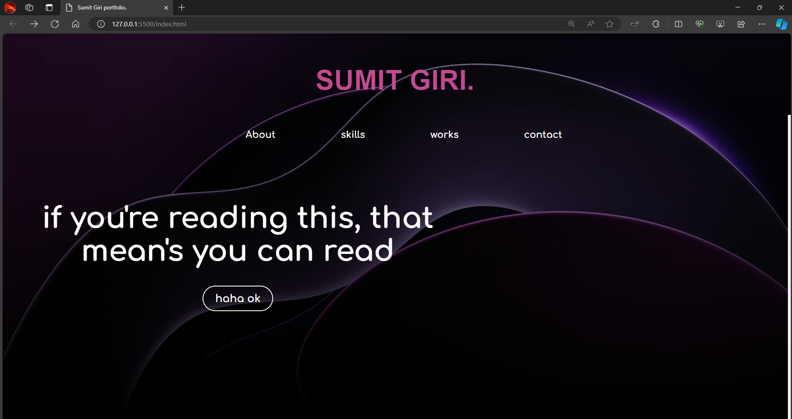
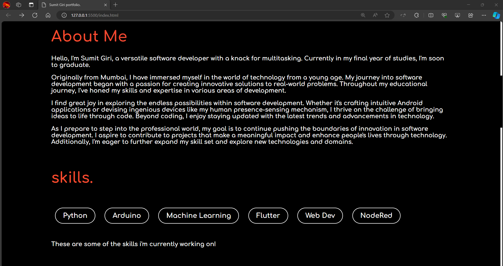
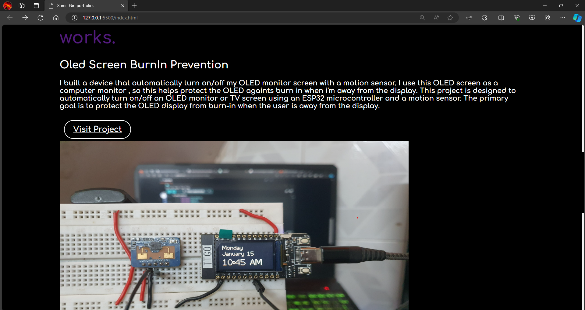
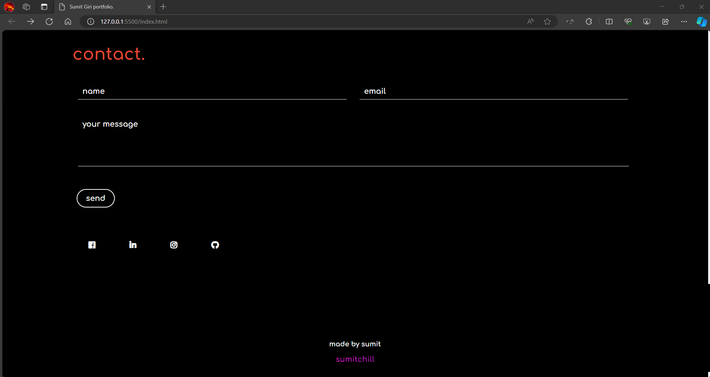

# Sumit Giri Portfolio

Welcome to my portfolio website, showcasing my skills, projects, and contact information.

## Introduction

This portfolio website serves as a platform to present my professional background, skills, and projects to potential employers, clients, and collaborators. It offers insights into my expertise in software development and design.

## Features

- **About Me:** An introduction to who I am, my background, and my interests.
- **Skills:** Overview of the technologies and skills I possess.
- **Works:** Showcase of my projects with descriptions and links to repositories or live demos.
- **Contact:** A form for visitors to reach out to me for inquiries, collaborations, or job opportunities.

## Technologies Used

- HTML5
- CSS3
- JavaScript
- [Animate.css](https://cdnjs.cloudflare.com/ajax/libs/animate.css/3.7.0/animate.min.css)
- [Google Fonts](https://fonts.googleapis.com/css?family=Comfortaa:700), [Modern Antiqua](https://fonts.googleapis.com/css2?family=Modern+Antiqua&display=swap)
- [jQuery](https://code.jquery.com/jquery-3.3.1.min.js)
- [Font Awesome](https://use.fontawesome.com/releases/v5.7.1/css/all.css)

## Setup and Usage

To view the website locally, follow these steps:

1. Clone this repository to your local machine.
2. Open `index.html` in your preferred web browser.

Alternatively, you can view the live version of the website [here](#insert-live-website-url).

## Screenshots

## Author

- **Sumit Giri**
- GitHub: [sumitchill](https://github.com/sumitchill)

## License

Not added yet!

